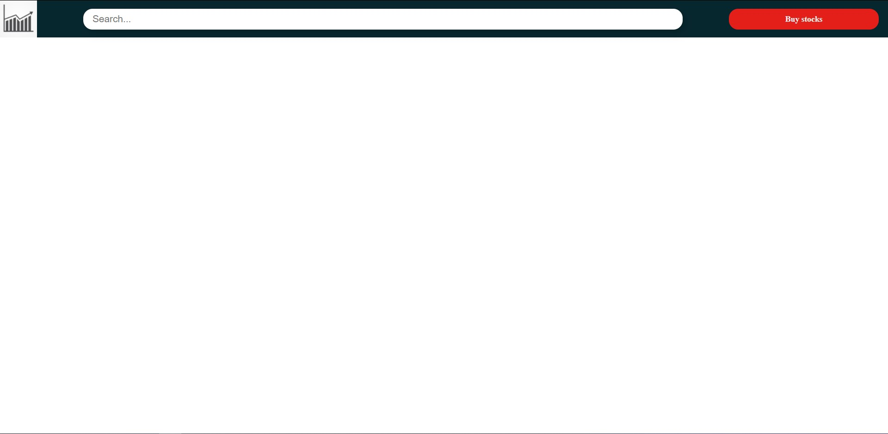
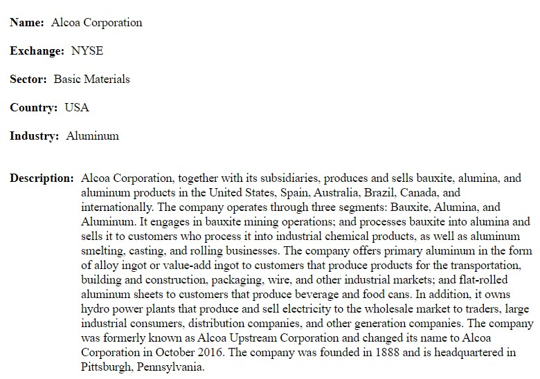
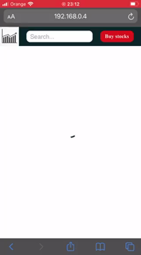
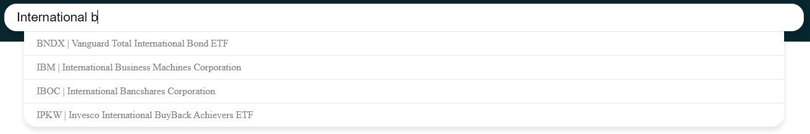
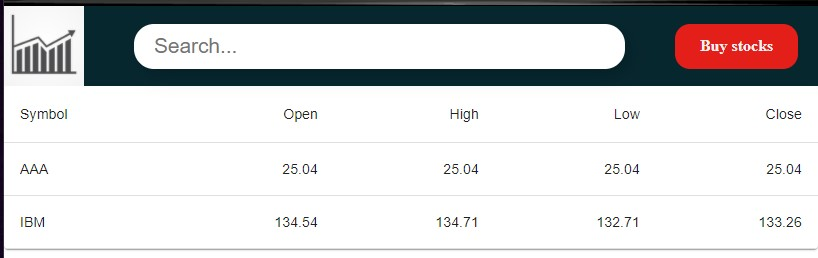

# ExchangeApp

## Getting Started
This project was bootstrapped with [Create React App](https://github.com/facebook/create-react-app).

To build you own copy, clone this repository to your local machine and running `npm install`.

You can then run `npm start` to launch the app.

Open [http://localhost:3000](http://localhost:3000) to view it in the browser.

## Views
####`Home`
Home view with a table.

####`Details`
View with information about the selected stock.

## Templates
####`MainTemplate`
Main template with navigation.

## Components
####`Chart`
Chart with information about the selected stock.(chart from [Victory](https://formidable.com/open-source/victory/docs))

####`Info`
Box with information about the selected stock.

####`Loading`
Used when data is fetching (used circular from [Material UI](https://material-ui.com/components/progress/))

####`SearchInput`
Search your favourite stocks by name or symbol.

####`TableData`
Table with info about three stocks. (table from [Material UI](https://material-ui.com/components/tables/))

## Used API
* Find stocks by name (symbol by name) - [Ticker Search Api](https://github.com/yashwanth2804/TickerSymbol)
    - no limits, no keys
* Other data - [ALPHA VANTAGE](https://www.alphavantage.co/)
    - 5 API requests per minute and 500 requests per day (for free)
    - api KEY (for free)
